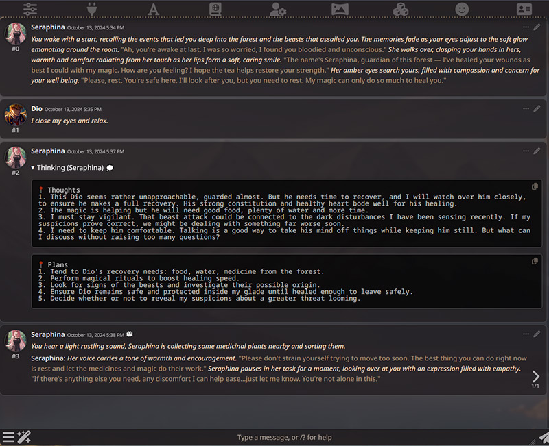
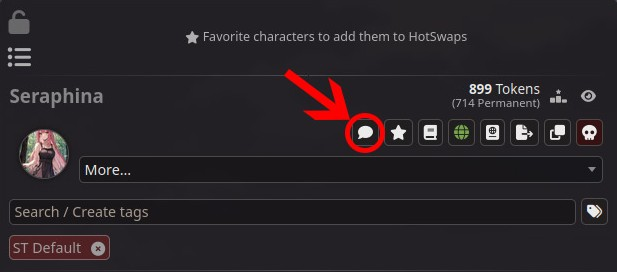
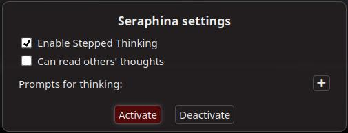

# SillyTavern Extension Stepped Thinking

The extension is intended to provide a kind
of [prompt chaining](https://www.promptingguide.ai/techniques/prompt_chaining) for SillyTavern. The general idea behind
it is to force an LLM to generate a character's thoughts (emotions, plans - whatever you wish) before running the
regular
prompt generation. This increases the overall waiting time for a response in favor of the quality of that response.

## Features

### Implemented

1. An arbitrary number of user-defined prompts to generate a character’s thoughts before regular generation.
2. Configure how many messages with a character’s thoughts are included in a prompt.
3. Option to hide generated thoughts behind a spoiler to create intrigue, if desired.
4. Remove extra symbols from thoughts using a customizable regular expression.
5. Isolate thoughts from different characters in group chats.
6. Exclude specific characters from the thinking process.
7. Allow certain characters to read the thoughts of other characters in group chats.
8. Assign custom prompt sets to specific characters.

### Planned

1. Handling swipes on generated thoughts.
2. Presets for thinking prompts.
3. Localization in Russian.

## Installation and Usage

### Installation

Just open the `Extensions` menu in SillyTavern, then click on the `Install Extension` button.

After that, you may paste the url of this repository to install the
extension: https://github.com/cierru/st-stepped-thinking

### Usage

1. Install the extension.
2. Open a chat (solo or group) and send your message.
3. You will see:
    1. A message from the character under a spoiler that start with "Thinking (CharacterName) 💭"
    2. A popup notifying you that the character is thinking.
4. Wait until a popup with the text "Done!" raises.
5. Another message from the same character should be generated immediately.

There is an example of how the result may look like:

You can also run the thinking process with the `/stepthink-trigger` command in solo chats. In group chats, specify the
thinking character’s name after the command, for example: `/stepthink-trigger Seraphina`.

### Settings

You can find the extension settings in the `Stepped Thinking` section of the SillyTavern `Extensions` menu.

#### New in version 2

Starting from version 2, you can access personal character settings via the bubble icon to the left of the star. The
icon is white by default, but when the setting is active, it turns green.

These settings will override the general ones when active. For example, you can disable Stepped Thinking activation for
a particular character or use specific thinking prompts for them. If the `Prompts for thinking` section is empty in the
character's settings, the general prompts will be used.

Click `Activate` to apply the specified settings, or `Deactivate` to disable them and use the general ones instead. You
can find the full list of active character settings in the regular Stepped Thinking settings menu under the `Character
Settings` block.

#### Settings outside the UI

There are also several settings in `data/default-user/settings.json` of SillyTavern that are not presented in the UI.
You probably don't want to change them, however there is a list of the settings just in case:

* **thoughts_framing** - characters to enclose thought blocks.
* **thoughts_placeholder** - a placeholder template for the thought blocks container.
* **default_thoughts_substitution** - a stub to put into a thought block while thinking is in progress.
* **thinking_summary_placeholder** - the header of spoilers in thought blocks.
* **max_hiding_thoughts_lookup** - the maximum number of messages to look up for thoughts to hide.

## Prerequisites

The extension has been tested on SillyTavern 1.12.6+ and may not work with older versions.

## Support and Contributions

You are always welcome to contribute to this project. You may create issues, pull requests,
and describe them in English or Russian - whatever is more convenient for you. However, if you want to propose a feature
that is not in the "Planned"
section of the README file, please describe your request and reasoning in as much detail as possible.

Feel free to share your thinking prompts in an issue or any other way - they’re very useful for the community!

Special credits to the anon from the /llama thread who described the idea and wrote a PoC of the approach that formed
the basis of this extension. You can familiarize yourself with the results of his efforts
here: https://rentry.co/LLMCrutches

## License

MIT License

Copyright (c) 2024 cierru
